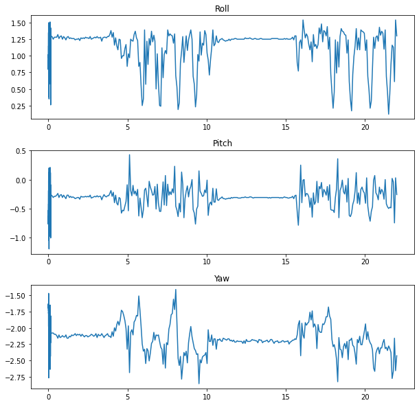
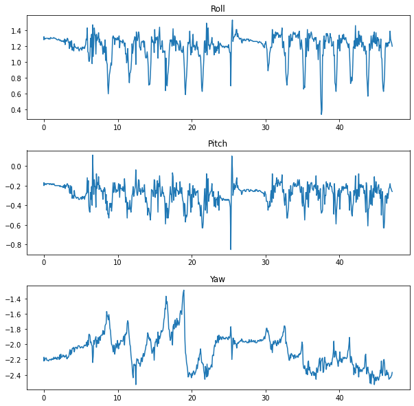
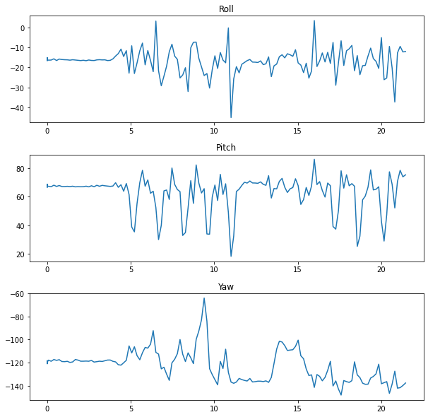
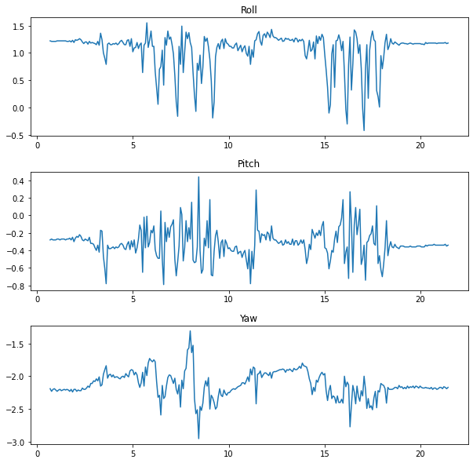
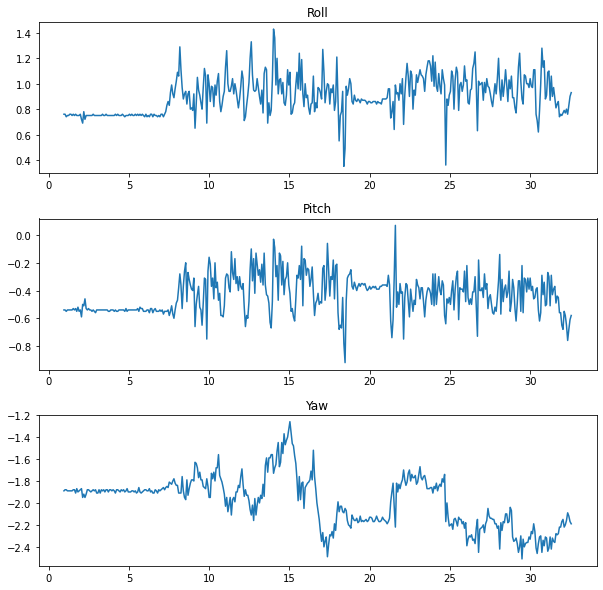
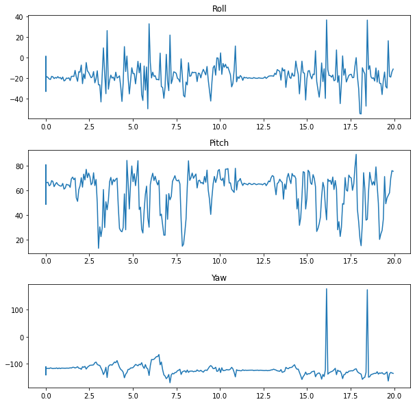

# Test Log
            2023년 1월 18일 김민정 작성

### **실험 상세 조건 명시**

**피실험자 스펙**
1. 피실험자1 : 23세 여성, 162cm  
2. 피실험자2 : 26세 남성, 172cm 
3. 피실험자2 : 26세 남성, 170cm

**센서 기준 축**

진행 방향 : Z축 Yaw 실험 조건(센서의 부착 위치 기준 축)은 무릎의 움직임을 볼 때 잘 변하지 않을 것으로 예상  

상하 방향 : X축 Roll 실험 조건에서 다리를 양옆으로 흔들 때, 무릎을 들어서 오른쪽으로 올리면 +0 ~ +10사이 , 왼쪽으로 올리면 -40 ~ -50 가만히 있다면 -10 ~ -20

좌우 방향 : Y축 Pitch 실험 조건에서 다리를 위로들고 뒤로 접을 때 변하는 값

---

**실험 장소**   
인천대학교 1층 취업 창업 라운지 내 약 10m

**실험 조건 및 결과**

> 피실험자의 오른 다리의 무릎 밑 관절에 부착

1. **일반 보행**   

    피실험자 1의 보행   
    

    피실험자 2의 보행
    

    피실험자 3의 보행
    

2. **빠른 보행**

    피실험자 1의 보행   
    

    

3. **느린 보행**
    목적: 느린 보행과 비교헀을 때 어떤 차이가 있을지 확인하고자함
    피실험자 1의 보행   
    

4. **인위적으로 보폭을 크게한 보행**   
목적 : 인위적으로 보폭을 크게 했을 때 Roll값의 변화가 큰 것을 확인하고자함

    피실험자 1의 보행
    

5. **인위적으로 보폭을 작게한 보행**

    피실험자 1의 보행
    

6. **인위적으로 8자걸음을 만든 보행**

    피실험자 3의 보행
    

### 당일 특이사항
- 모듈 구성(유선으로 구성하였기 때문에 임시적, 나중에 블루투스 센서를 이용해 모듈을 다시 만들 계획) 
